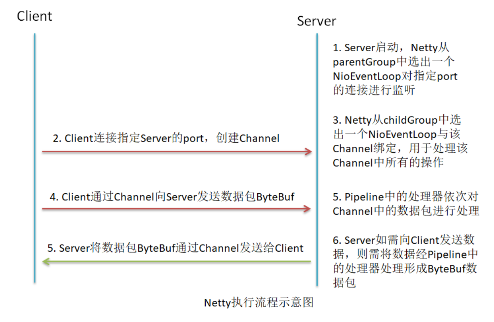
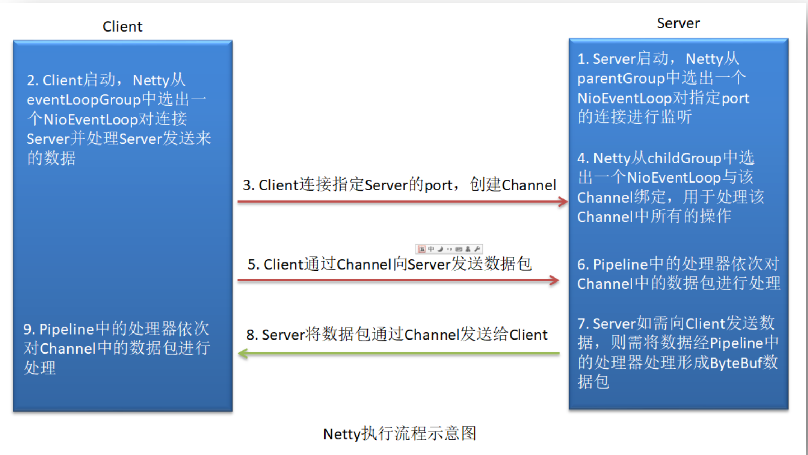

**Netty概述**

Netty 是一个异步事件驱动的网络应用程序框架，用于快速开发可维护的高性能服务器

和客户端。

 Netty 是一个 NIO 客户机-服务器框架，它支持快速、简单地开发网络应用程序，如服务

器和客户机。它大大简化了网络编程，如 TCP 和 UDP 套接字服务器。 

 “快速和简单”并不意味着生成的应用程序将受到可维护性或性能问题的影响。Netty

经过精心设计，并积累了许多协议（如 ftp、smtp、http）的实施经验，以及各种二进

制和基于文本的遗留协议。因此，Netty 成功地找到了一种方法，在不妥协的情况下实

现了易于开发、性能、稳定性和灵活性。

**谁在使用** **Netty**

Dubbo、zk、RocketMQ、ElasticSearch、Spring5(对 HTTP 协议的实现)、GRpc、Spark 等大

型开源项目都在使用 Netty 作为底层通讯框架。

**Netty** **中的核心概念**

**Channel**

管道，其是对 Socket 的封装，其包含了一组 API，大大简化了直接与 Socket 进行操作的复杂性。

客户端连接一次，服务器就创建一个channel ，多个请求也会创建多个channel

**EventLoopGroup**

EventLoopGroup 是一个 EventLoop 线程池，包含很多的 EventLoop。

Netty 为每个 Channel 分配了一个 EventLoop，用于处理用户连接请求、对用户请求的处理等所有事件。

EventLoop 本身只是一个线程驱动，在其生命周期内只会绑定一个线程，让该线程处理一个 Channel 的所有 IO 事件。

一个 Channel 一旦与一个 EventLoop 相绑定，则在 Channel 的整个生命周期内是不会也不能发生变化。但一个 EventLoop 可以与多个 Channel 相绑定。

**ServerBootStrap**

用于配置整个 Netty 代码，将各个组件关联起来。服务端使用的是 ServerBootStrap，而客户端使用的是则 BootStrap。

**ChannelHandler** **与** **ChannelPipeline**

ChannelHandler 是对 Channel 中数据的处理器，这些处理器可以是系统本身定义好的编解码器，也可以是用户自定义的。这些处理器会被统一添加到一个 ChannelPipeline 的对象中，然后按照添加的顺序对 Channel 中的数据进行依次处理。

**ChannelFuture**

Netty 中所有的 I/O 操作都是异步的，即操作不会立即得到返回结果，所以 Netty 中定义了一个 ChannelFuture 对象作为这个异步操作的“代言人”，表示异步操作本身。如果想获取到该异步操作的返回值，可以通过该异步操作对象的 addListener()方法为该异步操作添加监听器，为其注册回调：当结果出来后马上调用执行。Netty 的异步编程模型都是建立在 Future 与回调概念之上的。

**Pipeline**

可以包含有多个处理器

