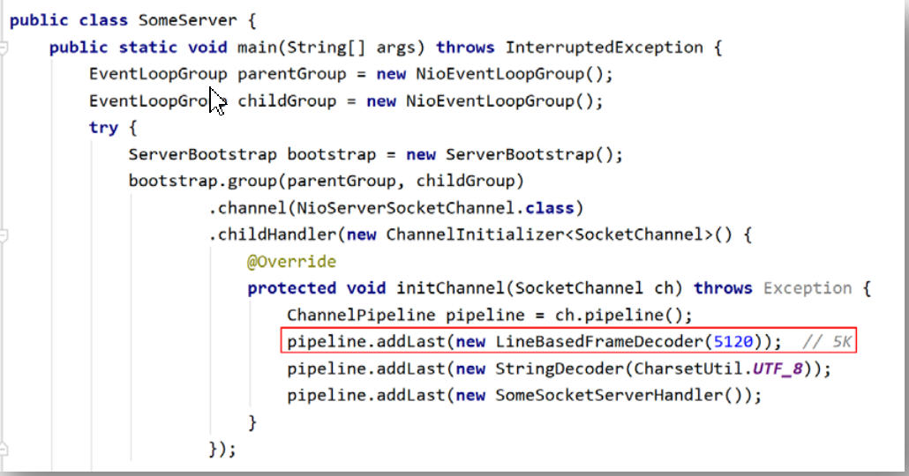

Netty 在基于 TCP 协议的网络通信中，存在拆包与粘包情况。拆包与粘包同时发生在数

据的发送方与接收方两方.

发送方通过网络每发送一批二进制数据包，那么这次所发送的数据包就称为一帧，即

Frame。在进行基于 TCP 的网络传输时，TCP 协议会将用户真正要发送的数据根据当前缓存

的实际情况对其进行拆分或重组，变为用于网络传输的 Frame。在 Netty 中就是将 ByteBuf

中的数据拆分或重组为二进制的 Frame。而接收方则需要将接收到的 Frame 中的数据进行重

组或拆分，重新恢复为发送方发送时的 ByteBuf 数据。

byte     bytebuf      string

具体场景描述：

 发送方发送的 ByteBuf 较大，在传输之前会被 TCP 底层拆分为多个 Frame 进行发送，这

个过程称为发送拆包；接收方在接收到需要将这些 Frame 进行合并，这个合并的过程称

为接收方粘包。

 发送方发送的 ByteBuf 较小，无法形成一个 Frame，此时 TCP 底层会将很多的这样的小

的 ByteBuf 合并为一个 Frame 进行传输，这个合并的过程称为发送方的粘包；接收方在

接收到这个 Frame 后需要进行拆包，拆分出多个原来的小的 ByteBuf，这个拆分的过程

称为接收方拆包。

 当一个 Frame 无法放入整数倍个 ByteBuf 时，最后一个 ByteBuf 会会发生拆包。这个

ByteBuf 中的一部分入入到了一个 Frame 中，另一部分被放入到了另一个 Frame 中。这

个过程就是发送方拆包。但对于将这些 ByteBuf 放入到一个 Frame 的过程，就是发送方

粘包；当接收方在接收到两个 Frame 后，对于第一个 Frame 的最后部分，与第二个 Frame

的最前部分会进行合并，这个合并的过程就是接收方粘包。但在将 Frame 中的各个

ByteBuf 拆分出来的过程，就是接收方拆包。

为了解决接收方接收到的数据的混乱性，接收方也可以对接收到的 Frame 包进行粘包与

拆包。Netty 中已经定义好了很多的接收方粘包拆包解决方案，我们可以直接使用。下面就

介绍几个最常用的解决方案。

接收方的粘包拆包实际在做的工作是解码工作。这个解码基本思想是：发送方在发送数

据中添加一个分隔标记，并告诉接收方该标记是什么。这样在接收方接收到 Frame 后，其会

根据事先约定好的分隔标记，将数据进行拆分或合并，产生相应的 ByteBuf 数据。这个拆分

或合并的过程，称为接收方的拆包与粘包。

**LineBasedFrameDecoder**

基于行的帧解码器，即会按照行分隔符对数据进行拆包粘包，解码出 ByteBuf。

在传送的string的末尾加上   System.getproperty("line.separator")

LineBasedFrameDecoder 的解码器要在 StringDecoder解码前面.byte-bytebuf-string

LineBasedFrameDecoder  是为了处理byte转换成bytebuf,StringDecoder是把bytebuf转换为string

**DelimiterBasedFrameDecoder**

基于分隔符的帧解码器，即会按照指定分隔符对数据进行拆包粘包，解码出 ByteBuf

