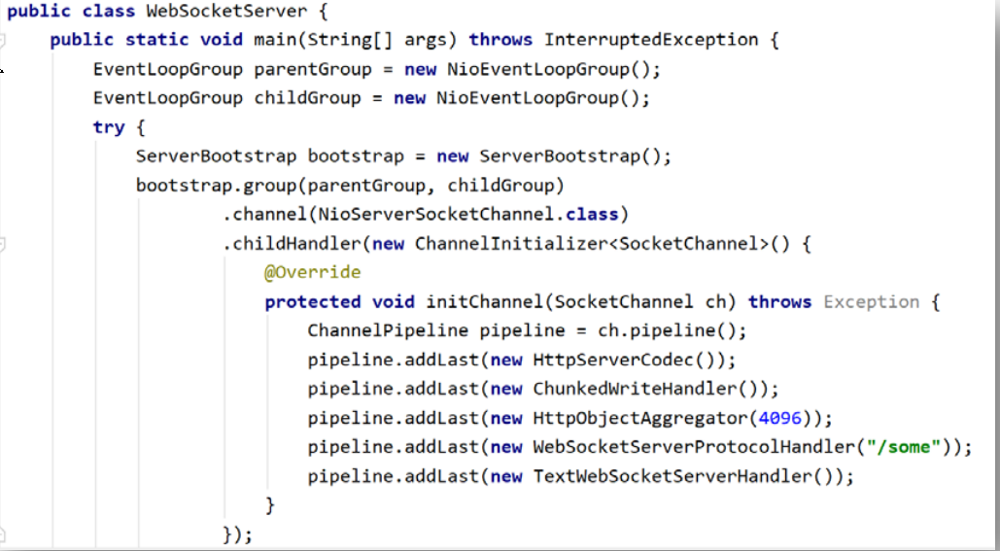
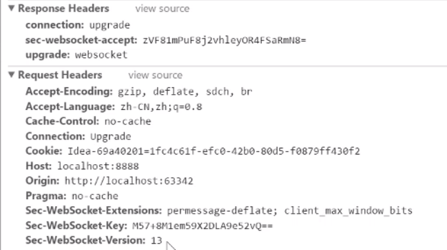

WebSocket 是 HTML5 中的协议，是构建在 HTTP 协议之上的一个网络通信协议，其以长

连接的方式实现了客户端与服务端的全双工通信。

HTTP/1.1 版本协议中具有 keep-alive 属性，实现的是半双工通信。

websocket只能在HTTP1.1版本中使用

设计到大量的http协议内容，需要对http协议有深入了解

**ChunkedWriteHandler**

io.netty.handler.stream.ChunkedWriteHandler.ChunkedWriteHandler()

HTTP不定长分段传输。不依靠content-length

**HttpObjectAggregator**

io.netty.handler.codec.http.HttpObjectAggregator

这个处理器将一个HttpMessage 和多个HttpContent聚合成一个FullHttpRequest和FullHttpResponse

响应头

io.netty.handler.codec.http.HttpMessage             HttpRequest和HttpResponse的头公用信息  

多个响应体 

io.netty.handler.codec.http.HttpContent				传输的chunk内容

websocket握手原理

Sec-websocket-version  	版本

Sec-websocket-key    		 随机key

Sec-websocket-accept        随机key加密后

 

io.netty.channel.group.DefaultChannelGroup    批量处理channel

io.netty.util.concurrent.GlobalEventExecutor   

是一个线程安全的集合，其中存放着与当前服务器相连接的所有Active状态的Channel

GlobalEventExecutor是一个单例、单线程的EventExecutor，是为了保证对当前group中的所有Channel的处理线程是同一个线程